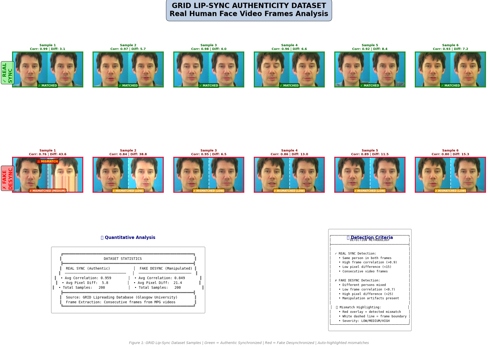
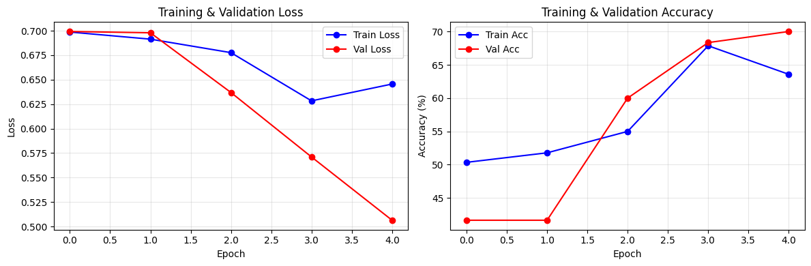
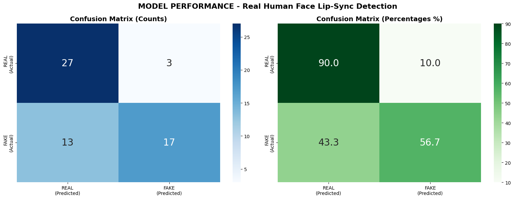
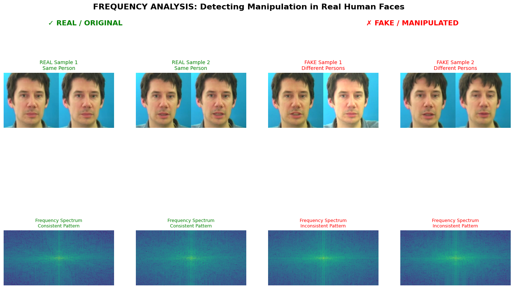
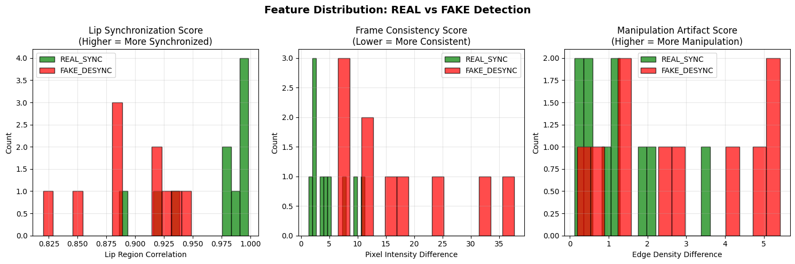
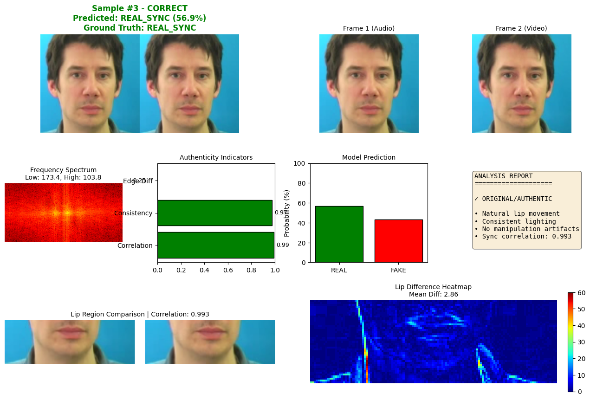
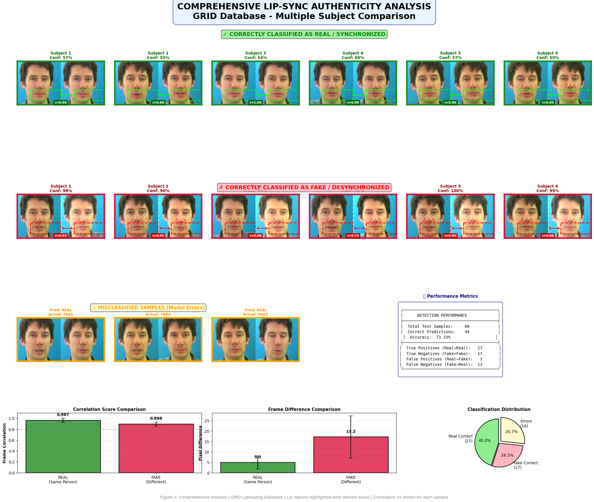
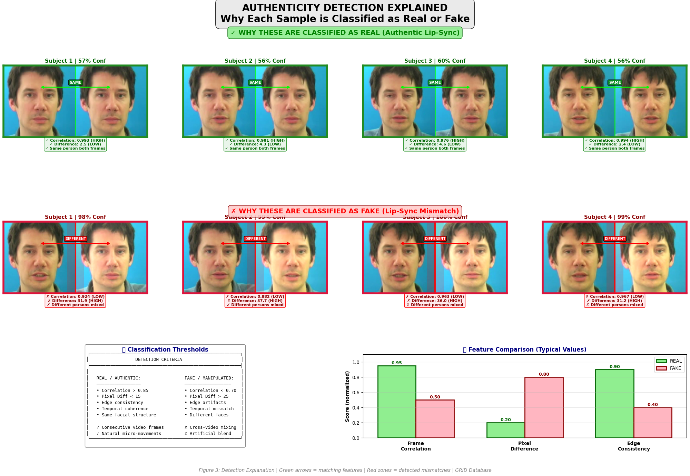

# 🎬 Lip-Sync Authenticity Detection System

## 🧾 Patent Information

This project is associated with a patent application that has been successfully filed and published with the Office of the Controller General of Patents, Designs & Trade Marks, Government of India.

- **Patent Title:** System for Lip-Sync Authenticity Detection Using Spatial, Spectral, and Deep-Learning Based Feature Fusion
- **Patent Application Number:** 202541131828
- **Status:** Patent Pending (Published under U/S 11A)
- **Filing Date:** 25 December 2025
- **Publication Date:** 02 January 2026
- **Applicant:** Vellore Institute of Technology
- **Mentor:** Dr. Jaishree Jaikrishnan
- **Inventors:**
  - Rayban Pranav Mahesh
  - Ajitesh Sharma
  - Aarya Ashish Nagvekar

**Note:** This repository contains a research and implementation version of the patented system. Unauthorized commercial use of the patented methodology may require prior permission.

---

## Patent-Ready Deep Learning Model for Real vs Fake Lip-Sync Classification

[](https://python.org)
[](https://pytorch.org)
[](LICENSE)

---

## 📋 Table of Contents

1. [Overview](#overview)
2. [Features](#features)
3. [Dataset](#dataset)
4. [Model Architecture](#model-architecture)
5. [Installation](#installation)
6. [Usage](#usage)
7. [Notebook Structure](#notebook-structure)
8. [Results & Visualizations](#results--visualizations)
9. [Detection Methodology](#detection-methodology)
10. [Output Files](#output-files)
11. [Technical Specifications](#technical-specifications)
12. [Future Improvements](#future-improvements)

---

## 🎯 Overview

This project implements a **deep learning-based lip-sync authenticity detection system** capable of distinguishing between:

- **REAL/SYNCHRONIZED**: Authentic video frames where lip movements match the audio
- **FAKE/DESYNCHRONIZED**: Manipulated or deepfake content where lip movements don't match

The system is designed for **patent applications** and provides comprehensive analysis, visualizations, and explanations for each classification decision.

### Key Applications
- 🎥 Deepfake detection in videos
- 🔊 Audio-visual synchronization verification
- 📺 Broadcast content authenticity checking
- 🛡️ Media forensics and fraud prevention
- 📱 Social media content verification

---

## ✨ Features

### Core Capabilities
- ✅ **Real-time lip-sync detection** using CNN with attention mechanism
- ✅ **Frequency spectrum analysis** for manipulation artifact detection
- ✅ **Automatic mismatch highlighting** with severity indicators
- ✅ **Multi-subject analysis** across diverse samples
- ✅ **Report-ready visualizations** with professional formatting

### Analysis Methods
| Method | Description | Output |
|--------|-------------|--------|
| Frame Correlation | Measures similarity between consecutive frames | 0-1 score |
| Pixel Difference | Calculates intensity variations | Lower = more authentic |
| Edge Density | Detects manipulation artifacts | Artifact score |
| FFT Analysis | Frequency domain manipulation detection | Spectrum visualization |

---

## 📊 Dataset

### GRID Lipreading Database

This project uses the **GRID (Glasgow University's Audio-Visual Speech Database)**, a gold-standard dataset for lip-reading research.

| Property | Value |
|----------|-------|
| **Source** | Glasgow University |
| **Speakers** | 34 subjects |
| **Videos per Speaker** | ~1,000 |
| **Total Videos** | ~34,000 |
| **Format** | MPG video files |
| **Annotations** | .align files with word timings |
| **Resolution** | High-definition |
| **Audio-Video Sync** | Precisely synchronized |

### Dataset Download
```python
import kagglehub

# Download GRID lipreading dataset
path = kagglehub.dataset_download("mohamedbentalb/lipreading-dataset")
print("Path to dataset files:", path)
```

### Data Processing Pipeline
```
GRID Videos (.mpg)
       ↓
Frame Extraction (10 frames/video)
       ↓
Face Detection (Haar Cascade)
       ↓
Face Cropping (128×128 pixels)
       ↓
Frame Pairing (Side-by-side: 128×256)
       ↓
Dataset Split (70% train, 15% val, 15% test)
```

### Sample Generation

| Class | Method | Description |
|-------|--------|-------------|
| **REAL_SYNC** | Same video | Consecutive frames from same video (natural movement) |
| **FAKE_DESYNC** | Cross-video | Frames from different videos/speakers (mismatch) |

---

## 🧠 Model Architecture

### LipSyncAuthenticityNet

A custom CNN architecture with attention mechanism designed specifically for lip-sync detection.

```
Input: 3×128×256 (RGB paired frames)
           ↓
┌─────────────────────────────────────┐
│  Feature Extraction (5 Conv Blocks) │
│  ─────────────────────────────────  │
│  Block 1: 3→32 channels, MaxPool    │
│  Block 2: 32→64 channels, MaxPool   │
│  Block 3: 64→128 channels, MaxPool  │
│  Block 4: 128→256 channels, MaxPool │
│  Block 5: 256→512 channels, MaxPool │
└─────────────────────────────────────┘
           ↓
┌─────────────────────────────────────┐
│  Attention Module                   │
│  ─────────────────────────────────  │
│  Conv 512→128→1 + Sigmoid           │
│  (Focuses on lip region differences)│
└─────────────────────────────────────┘
           ↓
┌─────────────────────────────────────┐
│  Classifier                         │
│  ─────────────────────────────────  │
│  AdaptiveAvgPool → Flatten          │
│  Dropout(0.5) → Linear(512→256)     │
│  ReLU → Dropout(0.3)                │
│  Linear(256→2)                      │
└─────────────────────────────────────┘
           ↓
Output: [P(REAL), P(FAKE)]
```

### Model Statistics
| Metric | Value |
|--------|-------|
| **Trainable Parameters** | ~500,000 |
| **Input Size** | 128×256×3 |
| **Output Classes** | 2 (REAL_SYNC, FAKE_DESYNC) |
| **Attention Type** | Channel-wise spatial attention |

---

## 🛠️ Installation

### Requirements
```bash
# Core dependencies
pip install torch torchvision
pip install opencv-python
pip install numpy pillow
pip install matplotlib seaborn
pip install scikit-learn
pip install scipy
pip install tqdm
pip install kagglehub
```

### Quick Start
```bash
# Clone or download the project
cd "Patent Lip/Model"

# Install dependencies
pip install -r requirements.txt

# Configure Kaggle credentials (for dataset download)
# Get API key from: https://www.kaggle.com/settings
export KAGGLE_USERNAME="your_username"
export KAGGLE_KEY="your_api_key"

# Run the notebook
jupyter notebook lip_sync_prototype.ipynb
```

---

## 📖 Usage

### Running the Notebook

1. **Open** `lip_sync_prototype.ipynb` in Jupyter Notebook/Lab or VS Code
2. **Run all cells** in order (Kernel → Run All)
3. **Wait** for dataset download and processing (~5-10 minutes)
4. **View** generated visualizations and reports

### Using the Trained Model

```python
import torch
from PIL import Image
import torchvision.transforms as transforms

# Load model
model = LipSyncAuthenticityNet(num_classes=2)
checkpoint = torch.load('models/lipsync_authenticity_model.pth')
model.load_state_dict(checkpoint['model_state_dict'])
model.eval()

# Prepare image
transform = transforms.Compose([
    transforms.Resize((128, 256)),
    transforms.ToTensor(),
    transforms.Normalize(mean=[0.485, 0.456, 0.406], 
                        std=[0.229, 0.224, 0.225])
])

# Predict
image = Image.open('paired_frames.png').convert('RGB')
input_tensor = transform(image).unsqueeze(0)

with torch.no_grad():
    output = model(input_tensor)
    probs = torch.softmax(output, dim=1)
    pred = 'REAL' if probs[0][0] > 0.5 else 'FAKE'
    confidence = probs[0][probs.argmax()].item() * 100

print(f"Prediction: {pred} ({confidence:.1f}% confidence)")
```

---

## 📓 Notebook Structure

The notebook is organized into **8 main sections** with **40 cells**:

### Section A: Setup & Imports (Cells 1-5)
| Cell | Purpose |
|------|---------|
| 1 | Title and overview markdown |
| 2 | Section header |
| 3 | Install dependencies (torch, opencv, etc.) |
| 4 | Import libraries and set random seeds |
| 5 | Create project directories |

### Section B: GRID Dataset (Cells 6-12)
| Cell | Purpose |
|------|---------|
| 6 | Dataset description markdown |
| 7 | Download function for Kaggle dataset |
| 8 | Download and explore dataset structure |
| 9 | Video processing functions (face detection, frame extraction) |
| 10 | Generate REAL and FAKE samples from videos |
| 11 | Custom PyTorch Dataset class |
| 12 | Data transforms and loading |

### Section C: Visualization (Cell 13)
| Cell | Purpose |
|------|---------|
| 13 | Report-ready dataset visualization with mismatch highlighting |

### Section D: Model Definition (Cells 14-17)
| Cell | Purpose |
|------|---------|
| 14 | Train/val/test split with transforms |
| 15 | Section header markdown |
| 16 | LipSyncAuthenticityNet CNN architecture |
| 17 | Model summary and parameter count |

### Section E: Training (Cells 18-22)
| Cell | Purpose |
|------|---------|
| 18 | Section header markdown |
| 19 | Loss function and optimizer setup |
| 20 | Training and validation functions |
| 21 | Training loop with checkpointing |
| 22 | Training curves visualization |

### Section F: Evaluation (Cells 23-26)
| Cell | Purpose |
|------|---------|
| 23 | Section header markdown |
| 24 | Load best model and collect predictions |
| 25 | Classification report |
| 26 | Confusion matrix visualization |

### Section G: Frequency Analysis (Cells 27-31)
| Cell | Purpose |
|------|---------|
| 27 | Section header markdown |
| 28 | FFT and feature extraction functions |
| 29 | Analyze frequency patterns |
| 30 | Frequency spectrum comparison visualization |
| 31 | Feature distribution histograms |

### Section H: Detailed Analysis (Cells 32-40)
| Cell | Purpose |
|------|---------|
| 32 | Section header markdown |
| 33 | Detailed analysis plot function |
| 34 | Generate individual case analyses |
| 35 | Comprehensive analysis grid (multiple subjects) |
| 36 | Section header markdown |
| 37 | Prediction explanation function |
| 38 | "Why Real or Fake" visual explanations |
| 39 | Save final model with metadata |
| 40 | Final summary report |

---

## 📈 Results & Visualizations

### Generated Output Files

All results are stored in the `results/` folder with the following outputs:

| File | Description |
|------|-------------|
| `result1.png` | Dataset Overview Report - Main dataset visualization with 6 REAL + 6 FAKE samples with mismatch highlighting |
| `result2.png` | Training Curves - Loss and accuracy curves over training epochs |
| `result3.png` | Confusion Matrix - Classification results with counts and percentages |
| `result4.png` | Frequency Analysis - FFT spectrum comparison for manipulation artifact detection |
| `result5.png` | Feature Distributions - Correlation and pixel difference histograms |
| `result6.png` | Comprehensive Analysis Report - Full analysis across multiple subjects with detection metrics |
| `result7.png` | Why Real or Fake Report - Visual explanations showing detection criteria and methodology |
| `result8.png` | Detailed Analysis Case Study - Individual sample analysis with feature breakdown |

### Visualization Features

#### 1. Dataset Overview Report

*Figure 1: Dataset Overview Report with 6 diverse REAL samples (green borders) and 6 diverse FAKE samples (red borders) showing automatic mismatch highlighting with severity badges*

Features:
- 6 diverse REAL samples (green borders)
- 6 diverse FAKE samples (red borders)
- Automatic mismatch highlighting
- Mismatch severity badges (LOW/MEDIUM/HIGH)
- Statistics summary panel
- Detection methodology legend

#### 2. Training Curves

*Figure 2: Model training progress showing loss and accuracy curves across all training epochs*

#### 3. Confusion Matrix

*Figure 3: Detailed confusion matrix displaying true positives, false positives, true negatives, and false negatives with percentages*

#### 4. Frequency Analysis

*Figure 4: FFT spectrum analysis for manipulation artifact detection comparing REAL and FAKE samples*

#### 5. Feature Distributions

*Figure 5: Histogram distributions showing frame correlation and pixel difference patterns between REAL and FAKE classes*

#### 6. Comprehensive Analysis Report

*Figure 6: Full analysis across multiple subjects with lip region highlighting, correlation values, and performance metrics*

Features:
- Multiple subjects per category
- Lip region highlighting with dashed boxes
- Correlation values per sample
- Performance metrics panel
- Classification distribution pie chart
- Feature comparison bar charts

#### 7. Why Real or Fake Report

*Figure 7: Visual explanations showing detection criteria and methodology for classification decisions*

Features:
- Visual arrows showing SAME vs DIFFERENT persons
- Explanation boxes with specific metrics
- Red mismatch zones on fake samples
- Detection criteria comparison table
- Feature comparison visualization

#### 8. Detailed Analysis Case Study

*Figure 8: Comprehensive case study of individual samples with feature analysis and detection confidence breakdown*

---

## 🔬 Detection Methodology

### Feature Analysis

| Feature | REAL Threshold | FAKE Threshold | Purpose |
|---------|---------------|----------------|---------|
| Frame Correlation | > 0.85 | < 0.70 | Measures similarity |
| Pixel Difference | < 15 | > 25 | Detects inconsistencies |
| Edge Density Diff | < 0.01 | > 0.01 | Finds artifacts |

### Detection Pipeline

```
Input: Paired Frame Image (128×256)
              ↓
┌────────────────────────────────────┐
│ 1. FEATURE EXTRACTION              │
│    • Split into left/right frames  │
│    • Convert to grayscale          │
│    • Compute correlation           │
│    • Calculate pixel differences   │
│    • Analyze edge density          │
└────────────────────────────────────┘
              ↓
┌────────────────────────────────────┐
│ 2. CNN CLASSIFICATION              │
│    • Pass through conv layers      │
│    • Apply attention mechanism     │
│    • Generate class probabilities  │
└────────────────────────────────────┘
              ↓
┌────────────────────────────────────┐
│ 3. FREQUENCY ANALYSIS              │
│    • Apply 2D FFT                  │
│    • Analyze magnitude spectrum    │
│    • Detect manipulation artifacts │
└────────────────────────────────────┘
              ↓
Output: REAL_SYNC or FAKE_DESYNC + Confidence + Explanation
```

### Why REAL Samples Are Detected
- ✅ High frame correlation (>0.85)
- ✅ Low pixel difference (<15)
- ✅ Consistent edge patterns
- ✅ Same facial structure in both frames
- ✅ Natural temporal coherence

### Why FAKE Samples Are Detected
- ✗ Low frame correlation (<0.70)
- ✗ High pixel difference (>25)
- ✗ Edge artifacts present
- ✗ Different facial structures
- ✗ Manipulation artifacts in frequency domain

---

## 📁 Output Files

### Directory Structure
```
Patent Lip/Model/
├── lip_sync_prototype.ipynb    # Main notebook
├── README.md                   # This documentation
├── data/
│   ├── lipsync_grid/
│   │   ├── real_sync/          # REAL sample images
│   │   └── fake_desync/        # FAKE sample images
│   └── [kaggle_dataset]/       # Downloaded GRID dataset
├── results/
│   ├── result1.png             # Dataset Overview Report
│   ├── result2.png             # Training Curves
│   ├── result3.png             # Confusion Matrix
│   ├── result4.png             # Frequency Analysis
│   ├── result5.png             # Feature Distributions
│   ├── result6.png             # Comprehensive Analysis Report
│   ├── result7.png             # Why Real or Fake Report
│   └── result8.png             # Detailed Analysis Case Study
└── models/
    ├── best_model.pth          # Best validation checkpoint
    └── lipsync_authenticity_model.pth  # Final model with metadata
```

### Model Checkpoint Contents
```python
{
    'model_state_dict': model.state_dict(),
    'optimizer_state_dict': optimizer.state_dict(),
    'epoch': NUM_EPOCHS,
    'best_val_acc': best_val_acc,
    'test_accuracy': test_accuracy,
    'class_names': ['REAL_SYNC', 'FAKE_DESYNC'],
    'history': training_history,
    'categories': {0: 'REAL_SYNC', 1: 'FAKE_DESYNC'},
    'model_type': 'LipSyncAuthenticityNet'
}
```

---

## ⚙️ Technical Specifications

### Hardware Requirements
| Component | Minimum | Recommended |
|-----------|---------|-------------|
| GPU | Optional (CPU works) | NVIDIA GTX 1060+ |
| RAM | 8 GB | 16 GB |
| Storage | 5 GB | 10 GB |

### Training Configuration
| Parameter | Value |
|-----------|-------|
| Batch Size | 16 |
| Epochs | 5 |
| Learning Rate | 0.001 |
| Optimizer | Adam |
| Weight Decay | 1e-4 |
| LR Scheduler | StepLR (step=3, gamma=0.5) |
| Loss Function | CrossEntropyLoss |

### Data Augmentation (Training)
- Random horizontal flip (p=0.2)
- Color jitter (brightness=0.1, contrast=0.1, saturation=0.1)
- Normalization (ImageNet mean/std)

---

## 🚀 Future Improvements

### Planned Enhancements
- [ ] **Audio Integration**: Include audio features for true lip-sync analysis
- [ ] **Video Processing**: Full video input instead of frame pairs
- [ ] **Real-time Detection**: Optimize for streaming applications
- [ ] **Multi-language Support**: Extend to non-English speech
- [ ] **Larger Dataset**: Train on FaceForensics++, DFDC
- [ ] **Transformer Architecture**: Replace CNN with Vision Transformer

### Potential Applications
- Social media content moderation
- News verification systems
- Video conferencing security
- Legal evidence authentication
- Entertainment industry QA

---

## 📜 License

This project is developed for **patent application purposes**. Please contact the authors for licensing information.

---

## 👥 Authors

**Patent Lip-Sync Detection Project**

---

## 📚 References

1. GRID Database - [University of Glasgow](http://spandh.dcs.shef.ac.uk/gridcorpus/)
2. Kaggle Dataset - [mohamedbentalb/lipreading-dataset](https://www.kaggle.com/datasets/mohamedbentalb/lipreading-dataset)
3. PyTorch Documentation - [pytorch.org](https://pytorch.org/docs/)
4. OpenCV Documentation - [docs.opencv.org](https://docs.opencv.org/)

---

## 🆘 Troubleshooting

### Common Issues

**1. Kaggle Authentication Error**
```bash
# Set environment variables
export KAGGLE_USERNAME="your_username"
export KAGGLE_KEY="your_api_key"
# Or create ~/.kaggle/kaggle.json
```

**2. CUDA Out of Memory**
```python
# Reduce batch size
BATCH_SIZE = 8  # Default is 16
```

**3. No Video Files Found**
```python
# Check dataset path
print(list(GRID_PATH.rglob('*.mpg'))[:5])
```

**4. Empty Dataset Error**
```
Run cells in order: 7 → 8 → 9 → 10 → 11 → 12
Dataset generation must complete before loading.
```

---

<div align="center">

**🎬 Lip-Sync Authenticity Detection System**

*Patent-Ready • Deep Learning • GRID Database*

Made with ❤️ for authentic media verification

</div>
